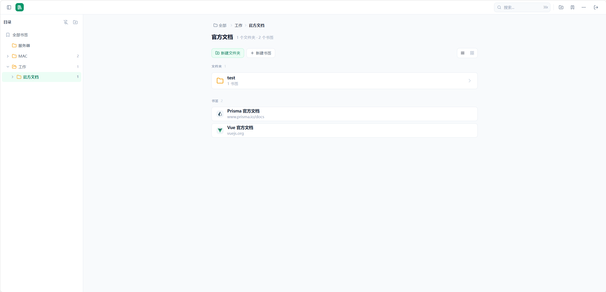
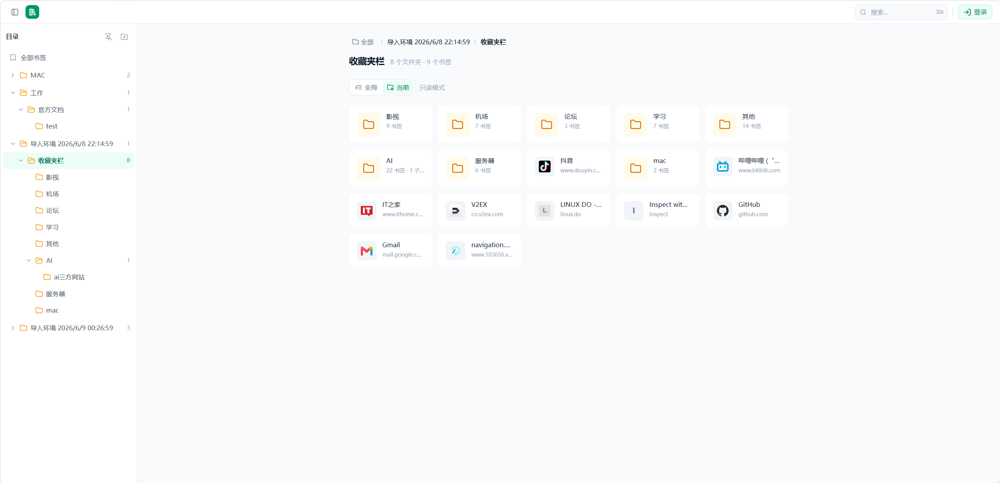

# Tree Bookmarks

在线书签管理器，支持无限嵌套文件夹、拖拽排序、导入导出。




## 快速开始

```bash
npm install
npm run dev
```

前端：http://localhost:5173  
后端：http://localhost:3000

## 权限控制

单账号模式，默认密码 `admin123`（可通过 `server/.env` 的 `ADMIN_PASSWORD` 修改）。

- **未登录**：只读模式，仅可浏览公开书签、搜索
- **登录后**：创建、编辑、删除、拖拽排序、导入、导出、设置书签阅读权限

每个书签可设为 `public`（公开）或 `private`（仅登录后可见）。

## 脚本

| 脚本 | 说明 |
|------|------|
| `npm run dev` | 同时启动前端（Vite :5173）和后端（Bun :3000） |
| `npm run dev:client` | 仅前端 |
| `npm run dev:server` | 仅后端 |
| `npm run build` | 构建前后端 |

## 一键部署

镜像由 GitHub Actions 自动构建，部署时直接拉取，无需现场编译：

```bash
docker run -d -p 3000:3000 -v booktree_data:/app/data ghcr.io/shaobo0123/booktree:latest
```

> 服务器需安装 Docker。部署后访问 `http://<服务器IP>:3000`，默认密码 `admin`。  
> 自定义密码：追加 `-e ADMIN_PASSWORD=MyPass123`。

## 部署到服务器

### 仅后端（配合 1Panel 或 nginx 反向代理）

```bash
./start-server.sh          # Bun 跑在 :3000，前端由 nginx serve
```

### 前后端一体（单端口，无需 nginx）

```bash
./start-full.sh            # 一个端口同时提供 API + 前端页面
```

### Docker 部署（推荐）

```bash
# 全量部署（前端 + 后端，单端口 3000）
docker compose up -d

# 仅后端 API（配合外部 nginx 反向代理）
SERVE_STATIC= docker compose up -d
```

数据持久化在 Docker volume 中，`DATABASE_URL`、`ADMIN_PASSWORD`、`JWT_SECRET` 等可通过环境变量覆盖：

```bash
ADMIN_PASSWORD=MyPass123 JWT_SECRET=xxx docker compose up -d
```

### 手动部署

1. 本地构建：`npm run build`
2. 把 `server/`、`client/dist/`、`start-server.sh`、`start-full.sh` 上传到服务器
3. 服务器安装 Bun：`curl -fsSL https://bun.sh/install | bash`
4. `cd server && bun install`
5. 启动：
   - 前后端一体：`./start-full.sh`
   - 仅后端（配合 nginx 反向代理）：`./start-server.sh`

### 环境变量

| 变量 | 默认值 | 说明 |
|------|--------|------|
| `PORT` | `3000` | 服务端口 |
| `DATABASE_URL` | `file:./prisma/dev.db` | SQLite 数据库路径 |
| `ADMIN_PASSWORD` | `admin` | 管理员登录密码 |
| `JWT_SECRET` | 内置开发密钥 | JWT 签名密钥 |
| `SERVE_STATIC` | 空 | 设为 `client/dist` 时后端直接 serve 前端 |
